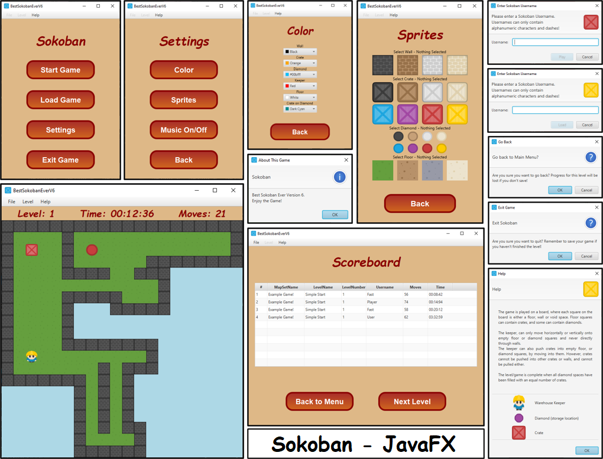
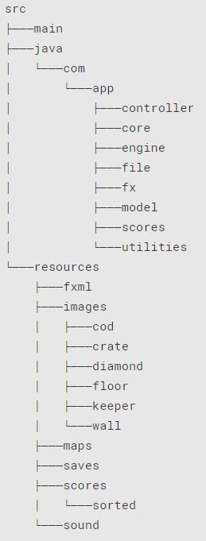

## Sokoban - JavaFX Software Development Project
  
### About  
Tested Operating System (working): **Windows 10** and **macOS Catalina**.  
  
Version: Java **jdk 11** and JavaFX **11.0.2**.  
  
Build tool: **Gradle**  
  
IDE: **IntelliJ IDEA**  
____  
 
### Compile and run instructions  
The application can be launched from IntelliJ IDEA, by building the project, using gradle `Tasks > build > build` then by running the app `Tasks > application > run`. 
____  
 
### Directory for Javadocs  
``./docs/index.html``  
____  
 
### All Scenes in the Game
  
____  
 
### Project Tree Structure  
  
____  
 
### Features and Modifications Implemented  
| No. | Change |  
| --- | ------ |  
| 1 | File structure edited, including the creation of packages and classes sorted into specific packages for greater organization. |  
| 2 | Ensure class variables are private and used assessor methods to support encapsulation. |  
| 3 | Split up classes into smaller classes to adhere to the idea of single responsibility. |  
| 4 | Project follows the basic structure of the MVC pattern. |  
| 5 | Marked unused methods as deprecated, and removed unused class. |  
| 6 | Added Singleton and Factory pattern implementations into code. |  
| 7 | Added concise Javadocs to all classes to be informative. |  
| 8 | Start menu, which option to start, load go to settings or exit  
 
### Extensions and Exciting features  
| No. | Feature |  
| --- | ------- |  
| 1 | Added ability for a user to input user name after start or load game. |
| 2 | Included a HUD above the playable level, for information on level number, current time, and a move counter. |
| 3 | Sprites choice included for every game object, with the bonus ability to pick a color, using the JavaFX ColorPicker. |
| 4 | Displays a scoreboard after each level is complete, shows the top 10 players sorted by time, and if time is equal, then sorted by moves, for that particular level, all managed by CSV files. |
| 5 | Added 8 additional playable levels to the game, so the user can challenge themselves. |
| 6 | Added Keeper directional walking animation, complete with moving legs and correct direction depending on if WASD or arrow keys are pressed. |
| 7 | Detect walls more than 2 blocks deep, using a flood-fill algorithm, sets them as void space. This makes the game more true to the original. |
| 8 | Fixed the game to end with the final move. |
| 9 | Save Game functionality, ability to reload game at a later date with same move count and position. |
| 10 | Background of transparent sprites match the current color of floor
| 11 | Reset level functionality. |
| 12 | Ability to undo any move in the current level an unlimited number of times. |
____  

### Design Patterns  
+ Singleton (used in Audio class)  
+ MVC (used in the entire project)  
+ Factory (used in GraphicObject Class)  
____

### Files introduced into the codebase    
#### Java class files  
+ StartController  
+ SettingsController  
+ GameController  
+ ScoreController  
+ GameLoader  
+ SaveGame  
+ LevelInfo  
+ PlayerStats  
+ ScoreboardManager  
+ Scoreboard  
+ Movement  
+ Notification  
+ Stopwatch  
+ Audio  

#### FXML and CSS  
+ start.fxml  
+ settings.fxml  
+ color.fxml  
+ sprites.fxml  
+ game.fxml  
+ score.fxml  
+ style.css  

#### JUnit Tests  
+ GameGridTest  
+ MainTest  
+ LevelTest  
____

### Classes modified from the codebase  
+ Main  
+ GameLogger  
+ GameGrid  
+ GraphicObject  

### Classes removed from the codebase  
+ StartMeUp  
____  

### Game Symbols  
| Character | Representation |  
| --------- | ---------- |  
| `C` | Crate |  
| `O` | Crate on Diamond |  
| `D` | Diamond |  
| ` ` | Floor |  
| `S` | Keeper |  
| `W` | Wall / Void Space |  
| `=` | Debug Space |  
___